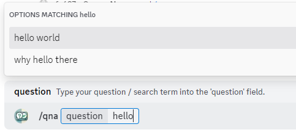

# Discord Q&A bot



> If you are looking for a **User Guide** or **visual examples** of the commands this bot provides, please check [User Guide](docs/user-guide.md).

Discord Bot with Questions and Answers (Q&A) functionality created using exclusively Discord's [Interaction API](https://discord.com/developers/docs/interactions/application-commands)

Creating a bot using only the Interactions API (slash commands) allows the bot to be deployed **serverless** and receive all updates from Discord instead of hosting bot 24/7 and querying the Discord Gateway API.

## Table of Content
- [Tech Stack](#tech-stack)
- [Known Issues and Caveats](#known-issues-and-caveats)
- [How To](#how-to)
    - [Run Locally](#run-locally)
    - [Deploy](#deploy)
    - [Use Test / Prod bots](#use-test--prod-bots)

## Tech Stack
- **Language** - TypeScript and Deno  
    Because Supabase uses Deno as Edge Functions platform
- **Discord Library** - [slash-create](https://github.com/Snazzah/slash-create)
- **Hosting** - [Supabase](https://supabase.com/), Backend as a Service solution  
    Provides PostgreSQL database and Edge Functions runtime

## Known Issues and Caveats
1) Currently, slash commands do not support multi-line inputs - https://github.com/discord/discord-api-docs/issues/2381

    Meaning User Experience of entering long strings is subpar to say the least.

    Possible workarounds:
    - Using Modal windows for long inputs (which is what I chose)  
        Downside of this approach is that Text Inputs on modal windows are obviously styled for mobile and cannot be resized. Better than no new lines at all but still not great
    - Have users enter string with literal '\n' in them  
        Amazing user experience isn't it? Maybe fine for personal use but definitely not for clients
    - Have user type separate normal message and create a [Message Command](https://discord.com/developers/docs/interactions/application-commands#message-commands) so user can Right Click on the message and choose action  
        Sounds better than second option but still highly unintuitive

2) Modal Windows cannot show custom errors to user - https://github.com/discord/discord-api-docs/discussions/4513

    When some error occurred / validation of input failed modal will close and only thing your bot can do is sending user a message that something went wrong. This modal closing action loses all the information user already filled in inputs and it is up to your bot to store and restore it.

## How To

### Run Locally
1) create `supabase/.env` file with the following environment variables:
    - `DISCORD_PUBLIC_KEY` - to verify that message came from discord
    - `SUPABASE_URL` - to access database via REST API
    - `SUPABASE_SERVICE_ROLE_KEY` - to access database via REST API
2) start the bot with
    ```bash
    deno run -A --env=supabase/.env supabase/functions/discord-bot/index.ts
    ```
3) start remote port forwarding to make local port available to public Internet (so Discord can reach it)  
    For example using `ngrok` - `ngrok http 8080`
4) follow to https://discord.com/developers/applications -> your bot's General Information -> add Interactions Endpoint URL in the format `<your_url_to_reach_local_app>/discord-bot`
5) if everything is well then you see discord send two interactions to your app - one 401 invalid and one ping-pong

### Deploy
```bash
npx supabase functions deploy discord-bot --no-verify-jwt
```

### Use Test / Prod bots
1) create two different bots
2) create `supabase/.env.test` with Test bot's `DISCORD_PUBLIC_KEY`
3) register all the same commands for Test bot using scripts in `./bot-control-commands`
4) run bot locally following [run locally](#run-locally) steps while replacing `.env` with `.env.test`
