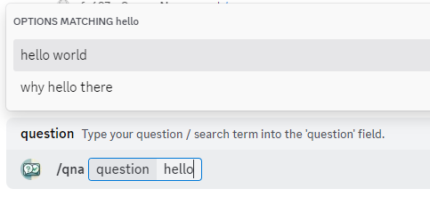
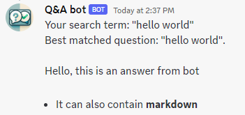
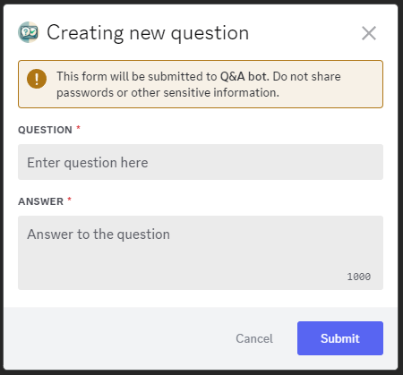
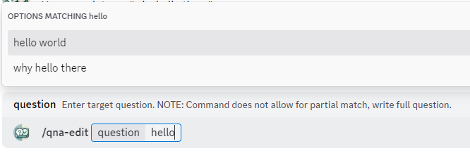
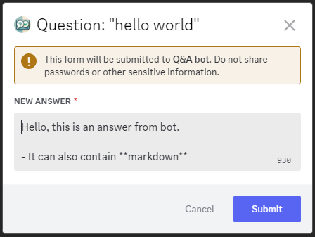
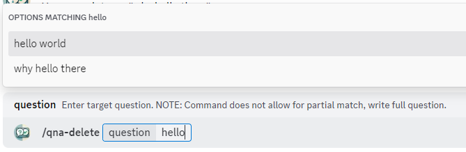
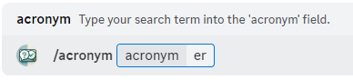
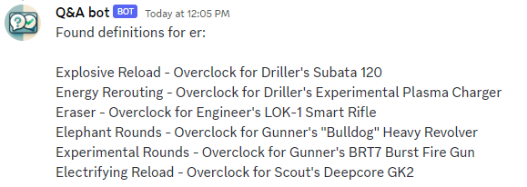

## Table of Content
- [How to Add the Bot to Your Server](#how-to-add-the-bot-to-your-server)
- [What Will the Bot Be Able to Do on My Server?](#what-will-the-bot-be-able-to-do-on-my-server)
- [How to Configure User Permissions to Access Bot Commands](#how-to-configure-user-permissions-to-access-bot-commands)
- [Global Bot Commands](#global-bot-commands)
  - [`/qna` - Search for Questions](#qna---search-for-questions)
  - [`/qna-new` - Add New Question and Answer Pair](#qna-new---add-new-question-and-answer-pair)
  - [`/qna-edit` - Edit Answer of an Existing Question](#qna-edit---edit-answer-of-an-existing-question)
  - [`/qna-delete` - Delete Question](#qna-delete---delete-question)
  - [`/qna-help` - Bot Usage Help](#qna-help---bot-usage-help)
- [Server-Specific Bot Commands](#server-specific-bot-commands)
  - [Deep Rock Galactic](#deep-rock-galactic)
    - [`/acronym` - Search For All Definitions of the Given Acronym](#acronym---search-for-all-definitions-of-the-given-acronym)

## How to Add the Bot to Your Server

Ask me for the bot invite link.

## What Will the Bot Be Able to Do on My Server?
When you follow the invite link,  you will see full list of requested permissions before adding the bot.

The bot only needs one permission to work:
- Create commands

See full list of commands [below](#global-bot-commands)

## How to Configure User Permissions to Access Bot Commands
Configuring access of users to bot's commands

Complete following steps as the **server admin**:
1) Create a new role called 'Q&A editor'.  
    The role name can be anything you prefer. You can also grant permissions to specific users.
2) Right-click on your server -> Server Settings -> Overview -> Integrations -> Q&A bot.
3) Change default bot permission from @everyone to the Q&A role.  
    It's easier to manage permissions by restricting access to commands by default and allowing specific commands for @everyone.  
    This approach also ensures you don't need to make changes when new commands are released.
4) Navigate to the /qna command in the list of commands and override it for @everyone.

You're done! Now, the Q&A role (and the server owner by default) has access to every command, while @everyone only has access to /qna.

## Global Bot Commands

### `/qna` - Search for Questions

To search for an answer to your question use command `/qna` and enter your question.

While you type there will be an autocompletion with hints of what questions match your current input (if any).

**Receiving an answer:**

### `/qna-new` - Add New Question and Answer Pair

To create a new question / answer pair use command `/qna-new` without any parameters. It will open a modal window where your can enter new question's details.

### `/qna-edit` - Edit Answer of an Existing Question

To edit a question's answer use command `/qna-edit`.

First you will need to find the questions you want to edit:

After choosing a question and sending command you will see Modal Window with text input.

Text input will be pre-filled with current answer to the question.

### `/qna-delete` - Delete Question

To delete a question use `/qna-delete` command.

### `/qna-help` - Bot Usage Help

Using `/qna-help` will return a link to this page.

## Server-Specific Bot Commands

### Deep Rock Galactic

#### `/acronym` - Search For All Definitions of the Given Acronym

